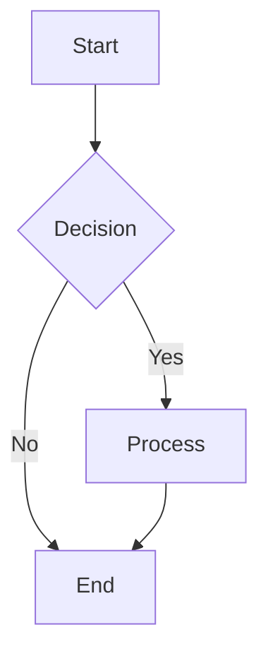
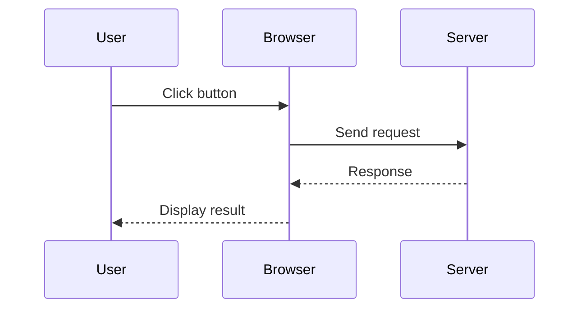
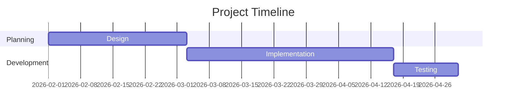
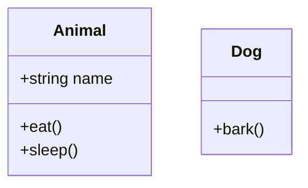
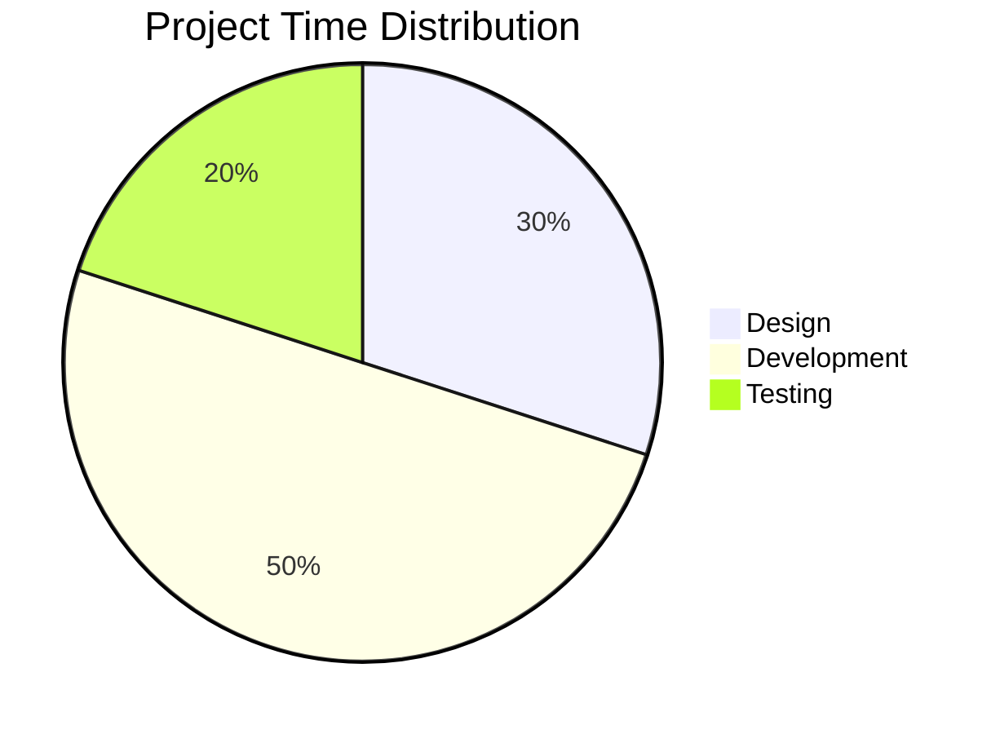
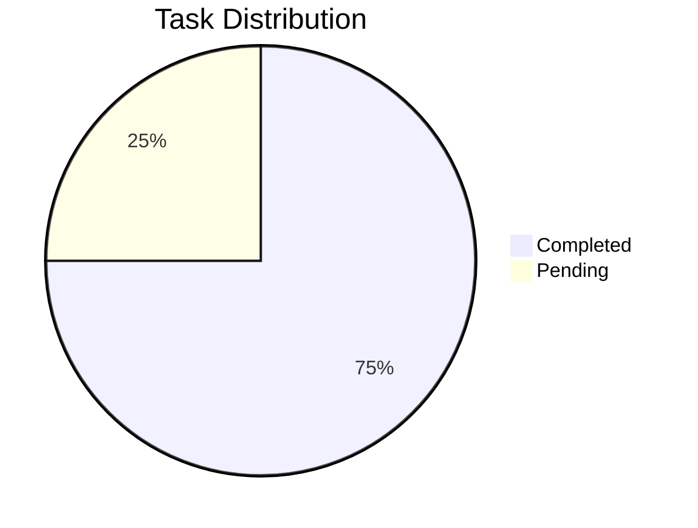
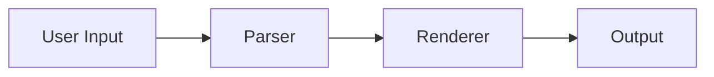

# KaTeX, Marked-KaTeX, and Mermaid Integration Guide

## Overview
Your markdown note editor now supports:
- **KaTeX** - LaTeX math equation rendering (inline & block)
- **Marked-KaTeX-Extension** - Integration with marked parser
- **Mermaid.js** - Rendering charts, diagrams, and flowcharts

This creates a rich markdown editor capable of displaying mathematical equations and visual diagrams alongside regular markdown content.

## Changes Made

### 1. **Package Dependencies**
The following packages are utilized:
- `katex: ^0.16.28` - LaTeX math rendering engine
- `marked-katex-extension: ^5.1.6` - Extension for marked to support KaTeX
- `mermaid: ^10.x.x` - Diagram and flowchart rendering

**Location:** [package.json](package.json)

### 2. **MarkdownEditor.jsx Modifications**

#### **Import Statements Added**
```jsx
import mermaid from 'mermaid';
import markedKatex from 'marked-katex-extension';
import 'katex/dist/katex.min.css';
```
**What changed:**
- Added import for mermaid for diagram rendering
- Added import for markedKatex (corrected to default export)
- Added KaTeX CSS file import

**Location:** [src/components/MarkdownEditor.jsx](src/components/MarkdownEditor.jsx#L1-L7)

#### **Component Initialization** (useEffect hooks)
```jsx
// Initialize marked with KaTeX extension and configure mermaid
useEffect(() => {
    marked.use(markedKatex({
        throwOnError: false
    }));
    
    // Initialize mermaid for diagram rendering
    mermaid.initialize({ startOnLoad: true, theme: 'default' });
}, []);

// Effect to render mermaid diagrams whenever markdown changes
useEffect(() => {
    if (markdown) {
        mermaid.contentLoaded();
    }
}, [markdown]);
```
**What it does:**
- Initializes KaTeX extension for marked (first useEffect)
- Initializes Mermaid with default theme (first useEffect)
- Calls `mermaid.contentLoaded()` whenever markdown changes to re-render diagrams (second useEffect)
- Runs initialization only once on component mount (empty dependency array)

**Location:** [src/components/MarkdownEditor.jsx](src/components/MarkdownEditor.jsx#L13-L28)

#### **Enhanced HTML Sanitization**
Updated `getMarkdownText()` function to allow SVG elements for mermaid diagrams:
```jsx
const sanitizedHtml = DOMPurify.sanitize(rawHtml, { 
    ALLOWED_TAGS: [..., 'svg', 'g', 'text', 'line', 'path', 'circle', ...],
    ALLOWED_ATTR: ['class', 'href', ..., 'xmlns', 'viewBox', 'cx', 'cy', ...]
});
```

**Location:** [src/components/MarkdownEditor.jsx](src/components/MarkdownEditor.jsx#L95-L104)

## How to Use KaTeX in Your Markdown

### Inline Math
Wrap equations with single dollar signs:
```
The equation $E = mc^2$ is famous.
```

### Block Math (Display)
Wrap equations with double dollar signs on separate lines:
```
$$
\frac{1}{2} \int_0^\infty e^{-x^2} dx = \frac{\sqrt{\pi}}{4}
$$
```

## How to Use Mermaid Diagrams

Mermaid diagrams are created using code blocks with the `mermaid` language identifier:

### Flowchart Example
````markdown

````

### Sequence Diagram Example
````markdown

````

### Gantt Chart Example
````markdown

````

### Class Diagram Example
````markdown

````

### Pie Chart Example
````markdown

````

## Combined Examples

### Test 1 - Math with Diagrams
````markdown
# Project Planning

The success rate is calculated as: $\frac{\text{completed tasks}}{\text{total tasks}} \times 100\%$


````

### Test 2 - Complex Document
````markdown
# System Architecture

The system follows this flow:



Mathematical relationship:
$$
\text{Output} = f(\text{Input}) = \int_0^x g(t) dt
$$
````

## Files Modified
1. **[src/components/MarkdownEditor.jsx](src/components/MarkdownEditor.jsx)**
   - Added Mermaid and marked-katex-extension imports
   - Added useEffect hooks for KaTeX and Mermaid initialization
   - Added second useEffect to call `mermaid.contentLoaded()` on markdown changes
   - Enhanced `getMarkdownText()` to sanitize SVG elements for diagram rendering

## Troubleshooting

### Issue: Math equations not rendering
- **Solution:** Verify that KaTeX CSS is imported (check line 5 of MarkdownEditor.jsx)
- Check browser console for any errors

### Issue: Invalid LaTeX throws errors
- **Solution:** The configuration has `throwOnError: false`, so invalid equations will be displayed as text instead of causing errors
- Verify your LaTeX syntax

### Issue: Mermaid diagrams not rendering
- **Solution:** Ensure code block has `mermaid` as the language identifier
- Check browser console for mermaid-specific errors
- Common issues:
  - Syntax errors in diagram definition
  - Unsupported mermaid diagram type
  - Missing newlines in code block

### Issue: Performance with many diagrams and equations
- **Solution:** 
  - Both KaTeX and Mermaid are optimized for performance
  - If issues occur, consider breaking large documents into smaller notes
  - Try disabling live preview for very large documents
  - Using simpler mathematical expressions

## Configuration Options

### KaTeX Configuration
The KaTeX extension can be customized by modifying the first `useEffect` hook in MarkdownEditor.jsx:

```jsx
marked.use(markedKatex({
    throwOnError: false,      // Don't throw errors for invalid LaTeX
    output: 'mathml',         // Can also use 'htmlAndMathml'
    // other options...
}));
```

For more KaTeX options, refer to: https://katex.org/docs/options.html

### Mermaid Configuration
The Mermaid initialization can be customized in the first `useEffect` hook:

```jsx
mermaid.initialize({ 
    startOnLoad: true,        // Auto-render on page load
    theme: 'default',         // Can use: 'dark', 'forest', 'neutral'
    logLevel: 'error',        // Logging level
    // other options...
});
```

For more Mermaid options, refer to: https://mermaid.js.org/config/configuration.html

## Supported Mermaid Diagram Types
- **Flowchart** - Process flows and decision trees
- **Sequence Diagram** - Interaction between objects
- **Gantt Chart** - Project timelines
- **Class Diagram** - OOP structure
- **State Diagram** - State machines
- **Pie Chart** - Data distribution
- **Bar Chart** - Comparative data
- **ER Diagram** - Entity relationships
- **Git Graph** - Version control workflows

For complete documentation: https://mermaid.js.org/

## No Additional Dependencies Required ✅
- Mermaid package is already installed
- All required packages present in `package.json`
- No npm install needed
- No breaking changes to existing functionality
- Fully backward compatible

## Testing Checklist
- [ ] Run `npm run dev` or `pnpm dev`
- [ ] Test inline math: `$E = mc^2$`
- [ ] Test block math: `$$\int_0^\infty$$`
- [ ] Test flowchart: ` ```mermaid graph TD... ``` `
- [ ] Test sequence diagram: ` ```mermaid sequenceDiagram... ``` `
- [ ] Test markdown rendering still works
- [ ] Test saving and loading notes with equations and diagrams
- [ ] Check AI documentation generation still works
- [ ] Verify no console errors
